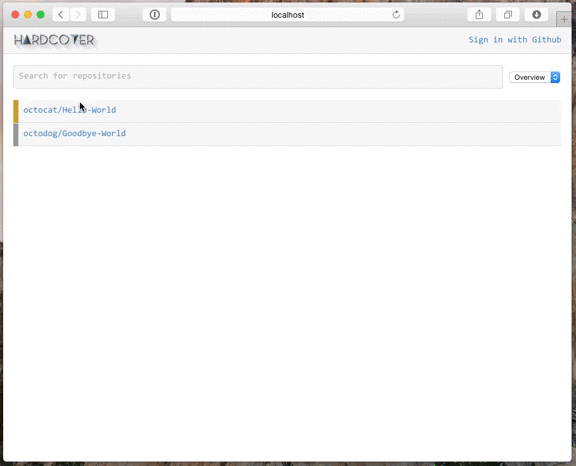

[](https://github.com/xing/hardcover)

[](https://travis-ci.org/xing/hardcover)
[](https://coveralls.io/r/xing/hardcover?branch=master)

Hardcover takes your coverage reports and stores them on the server, comments on your open pull requests and also gives you a fancy `svg` graphic for your README.



## Deployment
### Testing locally

We assume you have OS X as your local dev machine (and have [homebrew](http://brew.io) and VirtualBox installed).
If you do so, you are ready try out hardcover:

```bash
$ brew cask install vagrant
$ brew install vagrant
$ git clone https://github.com/xing/hardcover.git
$ cd hardcover/
$ vagrant up
$ vagrant ssh
$ cd /vagrant/
$ sudo gem install bundler
$ sudo bundle install
$ bundle exec rake db:create db:migrate db:seed
$ bundle exec rails server
```

When you did that you should be able to open your browser at `http://192.168.111.222:3000`

## Deploying to production

Please make sure the server you want to deploy to is not reachable from outside your network. Hardcover is completely designed to run in your own private infrastructure this means:

* Everyone with a GitHub or GitHub Enterprise account can login
* Everyone can read all repositories including the source code (coverage files)

This does not mean that this is unsafe it is just not designed to be public.

If you want to put this into production make sure to edit the following files:

* `config/config.yml`
* `config/application.rb`

For further instructions please consult the [Vagrantfile](https://github.com/xing/hardcover/blob/master/Vagrantfile).

## Usage

### Slather

As iOS developers we built this project with [slather](https://github.com/venmo/slather) in mind. That is why using this service with slather is really simple.

All you need to add is another of this fancy invisible files:

```yml
# .hardcover.yml
repo_token: "27dd855e706b22126ec6daaaf7bb40b5"
base_url: "http://api.hardcover.io"
```

The `repo_token` tells slather where to find your repository. If you have no `repo_token` you can find it on the repository page in hardcover.
Since hardcover is designed to be a self hosted solution we also need a `base_url` for the api.

Also add `hardcover` as a service to your `.slather.yml`, please consult our example:

```yml
# .slather.yml
coverage_service: hardcover
ci_service: jenkins_ci
xcodeproj: Example/Example.xcodeproj
source_directory: Classes
ignore:
  - Example/*
  - Example/Tests/*
```

To find help setting up slather consult the [slather instructions](https://github.com/venmo/slather#usage)

## Rails

Since we built hardcover ourself we wanted to elevate the meta level of this project to the maximum and wanted to cover hardcover with hardcover. Here is how you can achieve the same in your project.

```ruby
# Gemfile
...
group :test do
  gem 'coveralls', git: "https://github.com/xing/coveralls-ruby.git", branch: "hardcover"
end
```

```ruby
# spec_helper.rb
...
if ENV['RAILS_ENV'] == 'test'
  require 'coveralls'
  Coveralls.wear! 'rails'
end
...
```

```bash
# jenkins.sh
...
export HARDCOVER_REPO_TOKEN=your_repo_token # from https://hardcover.xing.hh/repos/<your_org>/<your_repo/
export COVERALLS_ENDPOINT="https://hardcover.xing.hh"
...
```

## Contact

XING AG

* https://github.com/xing
* https://twitter.com/xingdevs
* https://dev.xing.com

## License

Released under the MIT license. See the LICENSE file for more info.
